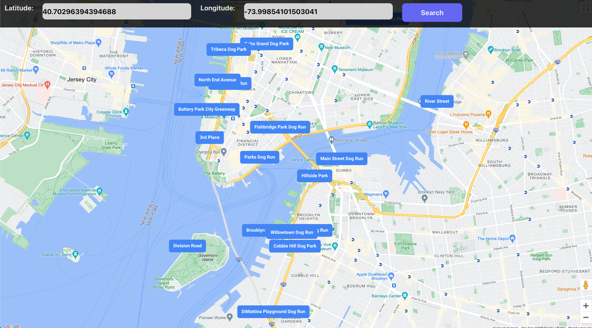

# D🐶g Park Findr 

Have you ever wondered what dog parks or pet friendly parks are nearby? D🐶g Park Findr is the answer! You can search in a surrounding radius of 5,000 meters from the specified coordinates! Instead of browsing online endlessly, save time by simply entering the coordinates of an area. D🐶g Park Findr has your bacK!

An example of searching for dog parks in New York City: 

Please Note: When first opened, the app may not display the initial map markers for the default coordinates. However, after entering in specified coordinates of a location it will begin to populate the map. Remember to leave out spaces when your type. Accidentally including spaces in a coordinate will throw and error.

# Technologies Used: 
-------------------------------
-   Google Maps API: https://developers.google.com/maps/documentation/javascript/libraries-open-source

-   Geoapify: https://www.geoapify.com/

-   Tailwindcsc: https://tailwindcss.com/

-   HTML

-   CSS

-   JavaScript

-   React

-   Git / Github

-   Vite

-   Node.js

# Getting Started:
------------------------------- 
You can visit the website here: https://main--singular-lily-7ff08c.netlify.app/

The Trello Board for planning: https://trello.com/b/Z0ERfOGs/dog-park-finder

